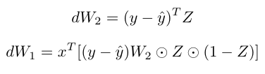
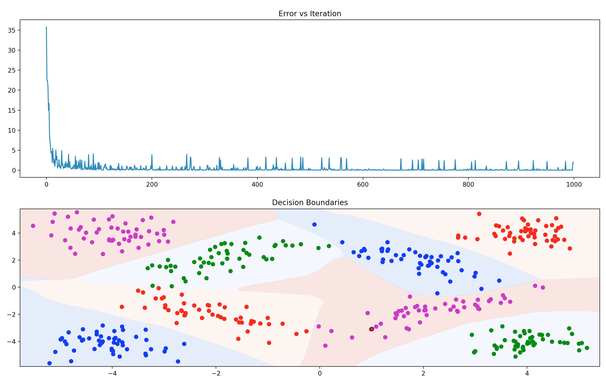

# COMP 521 Introduction to ML
## Homework 3
## Generating Training Data
To generate random samples from given multivariate Gaussian Distrubitions ```numpy.random.multivariate_normal``` method is used. ```Data``` class takes in a string as argument. This string has the following form ```<mean vector>$<first row of covariance matrix>$<num samples>$<class num>``` and for multiple distributions, these are separated with ```;```. ```Data``` class's ```get_training_data``` method is used to get the training data. This function takes input ```shuffle``` as a parameter. Default value for ```shuffle``` is ```True```.
Expected outputs are formed using one-hot representation for each class.
```python
for i in self.dataset.keys():
        one_hot = [0] * len(self.dataset)
        one_hot[i] = 1
        y.append(np.repeat([one_hot], len(self.dataset[i]), axis=0))

```
## Model  
The class ```MLP``` takes ```layer_size```, ```num_feats```, ```output_size``` and ```learning_rate``` as arguments.  
### Parameter Initialization  
Weight parameters ```input_weights``` and ```output_weights``` are initialized randomly from a normal distribution with 0 mean and 1e-3 standard deviation. These weights contains biases in them.    
### Training  
#### Forward Pass  
```python
def _forward(self, x):
      x_biased = self._add_bias(x)
      z = self._sigmoid(np.matmul(x_biased, self.input_weights))
      z_biased = self._add_bias(z)
      return np.matmul(z_biased, self.output_weights), z_biased, x_biased, z
```  
Forward pass is calculated as ```softmax(sigmoid(xW1)W2)```. Note that I am using row-first approach. ```input_weights``` has shape ```n+1 x h``` where ```n``` is feature size and ```h``` is hidden vector size, ```output_weights``` has shape ```h+1 x d``` and ```x``` has shape ```1 x n+1```.   
Softmax implementation is like the following  
```python   
def _softmax(self, x):
    return np.exp(x) / (np.sum(np.exp(x)))
```
I do not know if this is numerically stable but I haven't had any issue.  
Sigmoid implementation is like the following  
```python
def _sigmoid(self, x):
      try:
          result = 1 / (1 + np.exp(-x))
      except RuntimeWarning:
          result = np.zeros(x.shape)
      return result
```  
The ```_sigmoid``` function has ```expect RuntimeWarning``` to make sure that we do not get numerical instabilities. If this warning shows up, this means that our sigmoid values are close to zero.
#### Parameter Update  
Instead of using the algorithm in the book I took advantage of some basic linear algebra and converted the algorithm to the following:  
   
These parameter updates are applied ```epoch``` times. Instead of using a threshold to check convergence I preferred using epoch.
Numpy's ```argmax``` without the softmax function appliead to the last layer is used on the predicted outcomes to predict the class.  
#### Hyperparameters  
Learning rate: 0.1  
Epoch: 100
Hidden Size: 20
## Output
### Confusion Matrix
```
[[ 100.    0.    0.    0.]
 [   0.  100.    0.    0.]
 [   0.    0.   99.    1.]
 [   0.    0.    0.  100.]]
Accuracy: 99.75
```  
### Plots  
  
I have shuffled the whole data at each epoch, that is why there are some twitches in the error plot vs iterations.  
<br><br>
## How to Run?
```bash
$cd /path/to/
$python3 train.py
```
