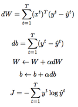
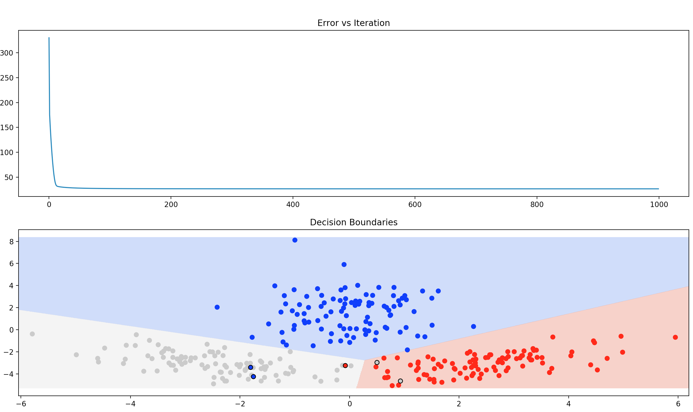

# Multivariate Linear Discrimination
## Generating Training Data
To generate random samples from given multivariate Gaussian Distrubitions ```numpy.random.multivariate_normal``` method is used.
Each generated class samples are concatenated to form batch.  
```python
X = np.concatenate((x1,x2,x3))
```
Expected outputs are formed using one-hot representation for each class.
```python
y1 = np.concatenate([[[1,0,0]] for _ in range(N1)])
y2 = np.concatenate([[[0,1,0]] for _ in range(N2)])
y3 = np.concatenate([[[0,0,1]] for _ in range(N3)])
y = np.concatenate((y1,y2,y3))
```
## Model  
### Parameter Initialization  
Weight parameters ```W``` are initialized randomly from a normal distribution with 0 mean and 1e-3 standard deviation.  
Bias parameters ```b``` are initialized as zero vector.  
### Training  
#### Forward Pass  
```python
def forward(self, x):
    return self._softmax(np.matmul(x, self.weights) + self.bias)
```  
Forward pass is calculated as ```softmax(xW + b)```. Note that I am using row-first approach. ```W``` has shape ```n x d``` where ```n``` is feature size and ```d``` is output vector size. ```x``` has shape ```1 x n``` and ```b``` has shape ```1 x d```.  
Softmax implementation is like the following  
```python   
def _softmax(self, x):
    return np.exp(x) / (np.sum(np.exp(x)))
```
I do not know if this is numerically stable but I haven't had any issue.
#### Parameter Update  
Instead of using the algorithm in the book (Alpaydin, page 252) I took advantage of some basic linear algebra and converted the algorithm to the following:  
  
I am sure that we can get rid of the summation too but since this is a small example that does not really matter.  
These parameter updates are applied ```epoch``` times. Instead of using a threshold to check convergence I prefer using epoch.
Numpy's ```argmax``` without the softmax function is used on the predicted outcomes to predict the class.  
#### Hyperparameters  
Learning rate: 0.01  
Epoch: 100
## Output
### Weights
```
Weights
[[-0.31469271 -2.91069691  3.22253112]
 [ 2.51799071 -1.03587434 -1.48282886]]
```
### Bias
```
[ 6.82677601 -2.39474486 -4.43203115]
```
### Confusion Matrix
```
predicted/actual
[[ 98.   0.   0.]
 [  2.  98.   1.]
 [  0.   2.  99.]]
Accuracy: 0.983
```
### Plots  

## How to Run?
```bash
$cd /path/to/0037975
$python3 train.py
```
